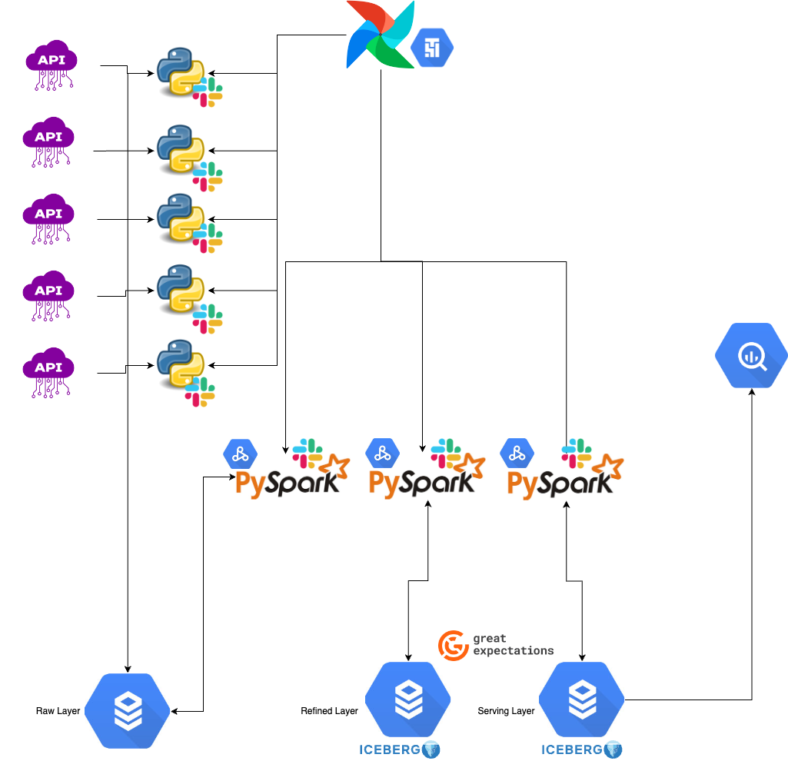

# Data Ingestion Layer

## Tools & Services:

Apache Airflow: Orchestrates the entire ingestion process, including scheduling and monitoring.
REST API Clients (Custom Scripts): Python-based scripts running in Airflow DAGs to extract data from multiple REST APIs.
Architecture:

Data Ingestion DAG: In Airflow, create a Directed Acyclic Graph (DAG) that schedules and orchestrates the data extraction process. Each REST API will have its dedicated DAG.

# Data Ingestion Process:

1. Airflow triggers Python scripts that call the REST APIs.
2. The data is fetched from the APIs and stored in raw JSON or CSV format in a dedicated bucket in Google Cloud Storage (GCS).
3. Each dataset is stored with a timestamped folder structure to ensure data versioning and traceability.

# Data Transformation Layer

## Tools & Services:

Google Dataproc: Managed Apache Spark and Hadoop service for scalable data processing.
Apache PySpark: For data transformation, cleansing, and aggregation.
Google BigQuery: For intermediate storage and querying.

## Architecture:
Batch Processing (using PySpark):

1. Airflow DAGs triggers PySpark jobs on Google Dataproc to process the raw data stored in GCS.
2. The PySpark jobs clean the data by handling missing values, normalizing formats, and applying any required transformations.
3. Aggregations and joins are performed to create a consistent and structured dataset.
4. The transformed data is then written back to GCS or directly into a staging table in Google BigQuery.

# Data Serving Layer

## Tools & Services:

Google BigQuery: A fully managed, serverless data warehouse to store and query structured data.
Looker Studio / Google Data Studio: For creating dashboards and data visualizations.
Google Cloud IAM: To manage access controls for data analysts and data scientists.
## Architecture:
Structured Data Storage:

1. Transformed data is stored in Google BigQuery as partitioned tables. This facilitates efficient querying by analysts and data scientists.
2. Tables are partitioned by time (e.g., daily, weekly) or by relevant business dimensions to optimize query performance.

## Data Access & Analytics:

1. Data analysts and data scientists can access the structured data in BigQuery using SQL queries through the BigQuery Console, Looker Studio, or other BI tools.
2. Looker Studio can be used to create interactive dashboards and reports based on the data stored in BigQuery.

# Additional Technical Requirements

## Error Handling and Retry Mechanisms:

### Airflow Retries & Alerting:

1. Configure retries within Airflow tasks for any failures in data extraction or transformation steps.
2. Use Airflow’s alerting mechanism (email, Slack) to notify the team of any persistent failures.
Data Quality Checks:

1. Implement data quality checks in Airflow using tools like Great Expectations to validate data at each stage.
2. If a data quality check fails, the pipeline should halt and send alerts.

## Monitoring:

### Google Cloud Monitoring & Logging:

1. Integrate Airflow, Dataproc, and Flink with Google Cloud Monitoring and Logging for real-time monitoring of the pipeline.
2. Set up anomaly detection alerts based on predefined thresholds or patterns in the data pipeline.

### Scalability:

#### Horizontal Scaling:

1. Use Google Dataproc's auto-scaling feature to handle increasing data volumes by dynamically adjusting the cluster size.
2. Design Airflow DAGs to be modular, allowing new APIs or data sources to be added easily without disrupting the pipeline.

# Overall Workflow:

1. Data Ingestion: Airflow triggers API calls, stores raw data in GCS.
2. Data Transformation: PySpark jobs clean and transform data, writing results to GCS or BigQuery.
3. Data Serving: BigQuery stores structured data for easy access by analysts and scientists.
4. Error Handling & Monitoring: Airflow manages retries and alerts; Google Cloud Monitoring tracks performance and anomalies.
5. Scalability: Google Dataproc ensure the pipeline scales with increasing data volumes.

